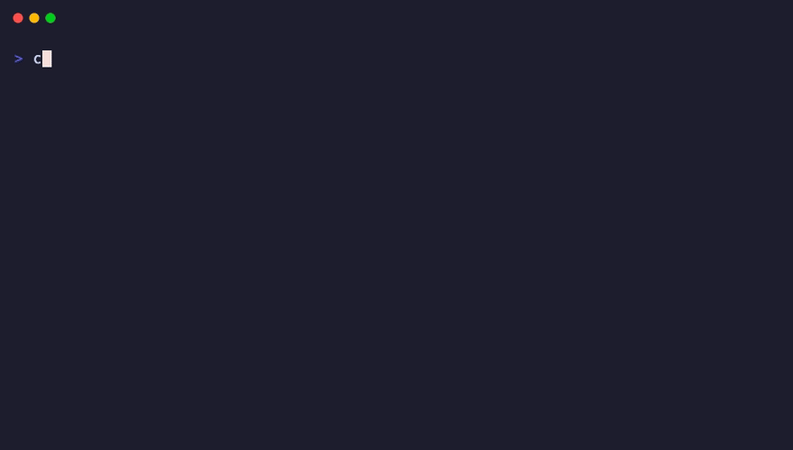

# create-mcpx

Scaffold a new [MCP](https://modelcontextprotocol.io) server project in seconds.

```bash
npx create-mcpx
```



Pick your language, target clients, and optional extras. Get a working MCP server with client config snippets, tests, Docker, and CI ready to go.

## Why

Every MCP server starts the same way: copy an example, rip out the parts you don't need, wire up the transport, figure out the config format for Claude Desktop vs Cursor vs VS Code, add a build step. `create-mcpx` does all of that in one command so you can skip straight to writing tools.

## Quick Start

### Interactive

```bash
npx create-mcpx
```

You'll be prompted for:
- **Server name** — lowercase, hyphens ok
- **Language** — TypeScript (recommended), Python, or Go
- **Target clients** — Claude Desktop, Cursor, VS Code, Windsurf (auto-selects the right transport)
- **Extras** — Tests, Dockerfile, GitHub Actions CI

### Non-Interactive

```bash
# Auto-detects stdio transport from client selection
npx create-mcpx my-server \
  --language typescript \
  --clients claude-desktop,cursor \
  --features tests,docker,ci

# Go server with auto-install
npx create-mcpx my-server \
  --language go --clients claude-desktop \
  --features tests,docker --install

# Preview without writing
npx create-mcpx my-server \
  --language python --dry-run
```

### Then

```bash
cd my-server
npm install    # or: pip install -e ".[dev]"
npm run build
npm test
```

The generated README includes ready-to-paste config snippets for each client you selected.

## Client Config Snippets

The hardest part of MCP server development is getting the client config right. Every client has a different format and file location. `create-mcpx` generates the exact JSON you need for each client:

| Client | Config Location | Format |
|--------|----------------|--------|
| Claude Desktop | `~/Library/Application Support/Claude/claude_desktop_config.json` | `mcpServers` |
| Cursor | `.cursor/mcp.json` | `mcpServers` |
| VS Code | `.vscode/settings.json` | `mcp.servers` |
| Windsurf | `~/.codeium/windsurf/mcp_config.json` | `mcpServers` |

Select your target clients during setup and the generated README will include copy-paste config for each one.

## Smart Transport Detection

Don't know whether to use stdio or Streamable HTTP? Just tell `create-mcpx` which clients you're targeting and it picks the right transport automatically:

- **Claude Desktop, Cursor, VS Code, Windsurf** → stdio
- **Remote/web deployment** → Streamable HTTP

## What You Get

### TypeScript + stdio

```
my-server/
├── src/
│   ├── index.ts          # Server entry point (stdio transport)
│   ├── tools.ts          # Tool definitions
│   └── __tests__/
│       └── tools.test.ts # Tests using InMemoryTransport
├── package.json
├── tsconfig.json
├── Dockerfile
├── .github/workflows/ci.yml
└── README.md             # Includes client config snippets
```

### TypeScript + Streamable HTTP

Same structure, but `index.ts` sets up an Express server with the `StreamableHTTPServerTransport`.

### Go + stdio

```
my-server/
├── main.go               # Server entry point
├── tools.go              # Tool definitions
├── tools_test.go         # Tests using mcptest
├── go.mod
├── Dockerfile
├── .github/workflows/ci.yml
└── README.md             # Includes client config snippets
```

### Python + stdio

```
my-server/
├── src/
│   ├── __init__.py
│   ├── server.py         # FastMCP server
│   └── tools.py          # Tool definitions
├── tests/
│   ├── __init__.py
│   └── test_tools.py
├── pyproject.toml
├── Dockerfile
├── .github/workflows/ci.yml
└── README.md             # Includes client config snippets
```

## Templates

The generated servers use the official [`@modelcontextprotocol/sdk`](https://github.com/modelcontextprotocol/typescript-sdk) for TypeScript, [`mcp`](https://github.com/modelcontextprotocol/python-sdk) for Python, and [`mcp-go`](https://github.com/mark3labs/mcp-go) for Go. Each template includes:

- A working `hello` tool as a starting example
- Proper transport setup (stdio or Streamable HTTP)
- Type-safe tool definitions (Zod for TypeScript, type hints for Python)
- Tests that run against the actual MCP protocol (no mocking)
- Client config snippets for every selected client

## Adding Tools

### TypeScript

Edit `src/tools.ts`:

```typescript
server.tool(
  'my-tool',
  'Description of what it does',
  { input: z.string().describe('What this input is') },
  async ({ input }) => ({
    content: [{ type: 'text', text: `Result: ${input}` }],
  }),
);
```

### Go

Edit `tools.go`:

```go
myTool := mcp.NewTool("my-tool",
    mcp.WithDescription("Description of what it does"),
    mcp.WithString("input", mcp.Description("What this input is"), mcp.Required()),
)

s.AddTool(myTool, func(ctx context.Context, request mcp.CallToolRequest) (*mcp.CallToolResult, error) {
    input := request.GetString("input", "")
    return mcp.NewToolResultText(fmt.Sprintf("Result: %s", input)), nil
})
```

### Python

Edit `src/tools.py`:

```python
@mcp.tool()
def my_tool(input: str) -> str:
    """Description of what it does."""
    return f"Result: {input}"
```

## Contributing

See [CONTRIBUTING.md](CONTRIBUTING.md) for development setup and how to add new language templates.

## License

MIT
